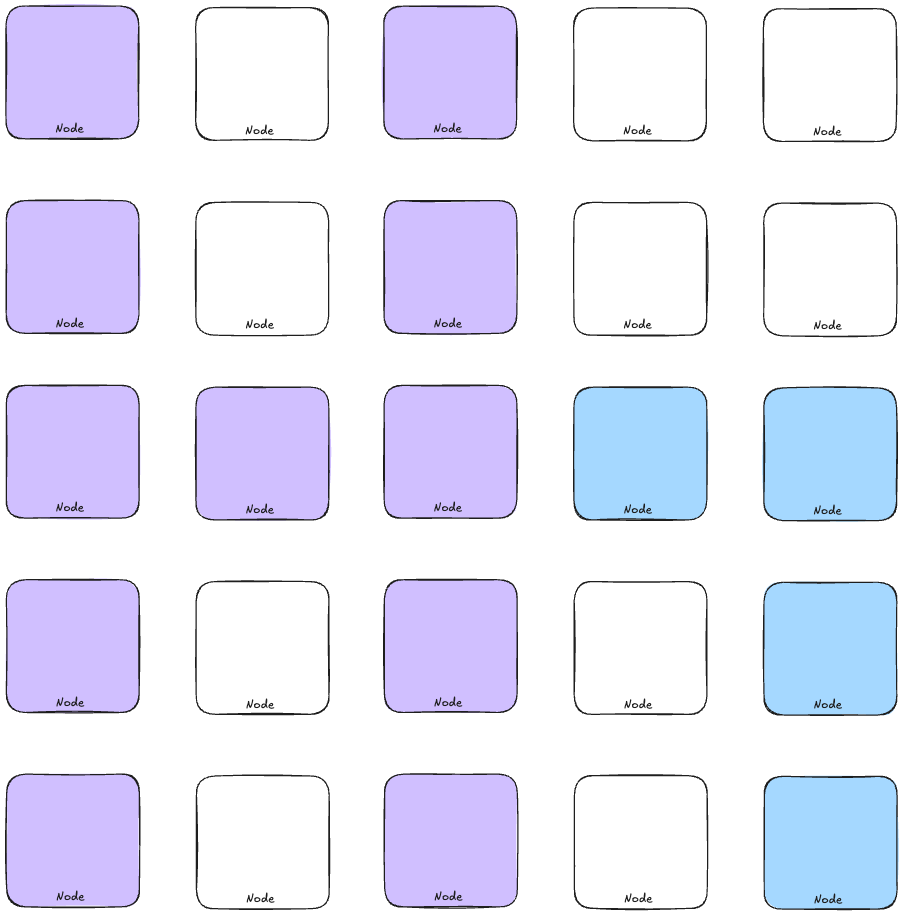

<div align="center">

<h1>Hivemind</h1>
<p><strong>A lightweight, distributed container orchestration platform built in Rust</strong></p>
</div>

## 🚀 What is Hivemind?

Hivemind is a modern, lightweight container orchestration system designed with simplicity and performance in mind. Think of it as a Kubernetes alternative that's easier to set up, understand, and operate - perfect for smaller deployments, edge computing, or when you need a container platform without the complexity.

## ✨ Key Features

- **🔄 Simple yet powerful** - Deploy containers with a clean REST API or straightforward CLI
- **⚡ Blazing fast** - Built in Rust for minimal resource usage and maximum performance
- **📦 Containerd integration** - Works directly with containerd for reliable container operations
- **🔍 Service Discovery** - Automatic DNS-based service discovery for your applications
- **🌐 Clustering** - Seamlessly scale from a single node to a distributed cluster
- **🔒 Volume Management** - Persistent storage for your stateful applications
- **🖥️ Clean Web UI** - Monitor and manage everything through an intuitive dashboard
- **🔌 Container Networking** - Seamless communication between containers across nodes
- **🔐 Security Features** - Container scanning, network policies, RBAC, and secret management
- **🩺 Health Monitoring** - Comprehensive health checking and auto-healing capabilities
- **📊 Network-Aware Scheduling** - Intelligent container placement based on network topology
- **🔄 Node Membership Protocol** - SWIM-based cluster membership management
- **🚀 Advanced Deployment Strategies** - Blue-green, canary, and A/B testing deployments
- **☁️ Cloud Provider Integration** - Seamless integration with AWS, Azure, and GCP
- **📈 Observability** - Prometheus metrics, OpenTelemetry tracing, and log aggregation
- **🔄 CI/CD Integration** - Built-in support for CI/CD pipelines and GitHub Actions
- **⚓ Helm Chart Support** - Deploy applications using Helm charts

## 🔧 Quick Start

### Install Hivemind

```bash
cargo install hivemind
```

### Start the daemon

```bash
hivemind daemon --web-port 3000
```

### Deploy your first application

```bash
hivemind app deploy --image nginx:latest --name my-web-app --service web.local
```

Visit `http://localhost:3000` to see your application in the Hivemind dashboard!

## 📋 Command Reference

Hivemind offers a comprehensive CLI for all operations:

### Global Options

```bash
hivemind --data-dir <PATH>  # Set the data directory (default: ~/.hivemind)
```

### Daemon Mode

```bash
# Start the Hivemind daemon
hivemind daemon --web-port <PORT>  # Start the server (default port: 3000)

# Start only the web interface (useful for development)
hivemind web --port <PORT>  # Start only the web UI (default port: 3000)
```

### Cluster Management

```bash
# Join an existing Hivemind cluster
hivemind join --host <HOST_ADDRESS>  # Connect to an existing cluster

# List all nodes in the cluster
hivemind node ls

# Show detailed node information
hivemind node info
```

### Application Management

```bash
# List all applications
hivemind app ls

# Deploy a new application
hivemind app deploy --image <IMAGE> --name <NAME> [--service <DOMAIN>]

# Scale an application to a specific number of replicas
hivemind app scale --name <NAME> --replicas <COUNT>

# List all containers
hivemind app containers

# Show detailed container information
hivemind app container-info --container-id <CONTAINER_ID>

# Restart an application
hivemind app restart --name <NAME>
```

### System Health

```bash
# Check system health
hivemind health  # Shows health status of nodes, containers, and services
```

### Volume Management

```bash
# Create a new volume
hivemind volume create --name <VOLUME_NAME>

# List all volumes
hivemind volume ls

# Delete a volume
hivemind volume delete --name <VOLUME_NAME>

# Deploy with volume mounts
hivemind app deploy --image <IMAGE> --name <NAME> --volume <VOLUME_NAME>:<CONTAINER_PATH>
```

### Security Management

```bash
# Scan a container image for vulnerabilities
hivemind security scan-image --image <IMAGE>

# List security policies
hivemind security list-policies

# Create a new secret
hivemind security create-secret --name <NAME> --file <FILE_PATH>

# Mount a secret to a container
hivemind app deploy --image <IMAGE> --name <NAME> --secret <SECRET_NAME>:<CONTAINER_PATH>
```

## 🔌 API Reference

Hivemind offers a RESTful API for all operations:

| Endpoint | Method | Description |
|----------|--------|-------------|
| `/api/nodes` | GET | List all nodes |
| `/api/containers` | GET | List all containers |
| `/api/images` | GET | List available images |
| `/api/services` | GET | List all services |
| `/api/service-endpoints` | GET | List all service endpoints |
| `/api/health` | GET | Get system health metrics |
| `/api/deploy` | POST | Deploy a new container |
| `/api/scale` | POST | Scale an application |
| `/api/restart` | POST | Restart an application |
| `/api/service-url` | POST | Get URL for a service |
| `/api/volumes` | GET | List all volumes |
| `/api/volumes/create` | POST | Create a new volume |
| `/api/volumes/delete` | POST | Delete a volume |
| `/api/security/scan` | POST | Scan a container image |
| `/api/security/policies` | GET | List security policies |
| `/api/security/secrets` | GET | List secrets (metadata only) |
| `/api/security/secrets/create` | POST | Create a new secret |

## 🌟 Why Hivemind?

### For Users
- **Simple to learn** - No steep learning curve or complex YAML files
- **Resource-efficient** - Runs well even on lower-powered hardware
- **Predictable** - Designed to be stable and behave consistently
- **Self-contained** - Minimal dependencies means fewer things to break
- **Secure by default** - Built-in security features protect your workloads

### For Developers
- **Clean codebase** - Well-structured Rust code that's a joy to work with
- **Modular architecture** - Easy to extend with new features
- **API-first design** - Build tools and integrations with our comprehensive API
- **Fast compile-test cycle** - Quick iteration for development
- **Comprehensive security** - Security features built into the core platform

## 📊 Comparison with other platforms

| Feature | Hivemind | Kubernetes | Docker Swarm |
|---------|----------|------------|---------------|
| Startup time | ⚡ Seconds | ⏱️ Minutes | ⏱️ Minutes |
| Memory usage | 🍃 ~50MB | 🏋️ ~500MB+ | 🏋️ ~200MB+ |
| Learning curve | 📘 Low | 📚 High | 📗 Medium |
| Scaling | ✅ Yes | ✅ Yes | ✅ Yes |
| Auto-healing | ✅ Yes | ✅ Yes | ✅ Yes |
| Cloud native | ✅ Yes | ✅ Yes | ⚠️ Partial |
| Security features | ✅ Comprehensive | ✅ Extensive | ⚠️ Basic |
| Network-aware scheduling | ✅ Yes | ✅ Yes | ❌ No |

## 🧩 Architecture

Hivemind follows a clean, modular architecture:

- **App Manager** - Application and container lifecycle management
- **Node Manager** - Cluster coordination and node discovery
- **Node Membership Protocol** - SWIM-based cluster membership management
- **Service Discovery** - DNS-based service discovery and routing
- **Storage Manager** - Volume and persistence handling
- **Container Manager** - Container runtime integration
- **Network Manager** - Container networking and overlay network
- **Scheduler** - Network-aware container placement
- **Health Monitor** - Container and node health monitoring
- **Security Manager** - Security features including scanning, RBAC, and secrets
- **Web UI** - Dashboard and visual management
- **Deployment Manager** - Advanced deployment strategies (blue-green, canary, A/B testing)
- **Cloud Manager** - Integration with cloud providers (AWS, Azure, GCP)
- **Observability Manager** - Metrics, tracing, and logging
- **CI/CD Manager** - CI/CD pipeline integration
- **Helm Manager** - Helm chart support

For more details, see [ARCHITECTURE.md](ARCHITECTURE.md).

## 📦 Features in Detail

### Container Management

Hivemind provides comprehensive container lifecycle management:

- **Deploy containers** from various image sources
- **Scale applications** up or down with automatic load balancing
- **Restart containers** with zero downtime
- **Monitor container metrics** including CPU, memory, and network usage
- **View container logs** directly from the dashboard

### Service Discovery

Enhanced DNS-based service discovery allows:

- **Service domains** for easy access to your applications
- **Automatic load balancing** across container instances with multiple strategies
- **Advanced health checking** with configurable protocols and parameters
- **Built-in DNS server** for resolving service domains
- **Network integration** for seamless cross-node communication
- **Circuit breaking** to prevent routing traffic to unhealthy endpoints

### Volume Management

Persistent storage for stateful applications:

- **Create and manage volumes** for persistent data
- **Mount volumes** to containers during deployment
- **Back up volume data** for disaster recovery
- **Monitor volume usage** to prevent storage issues

### Clustering

Distributed operation for scaling and high availability:

- **Auto-discovery** of nodes on the network
- **Seamless joining** of new nodes to the cluster
- **Resource-aware scheduling** of containers
- **Node health monitoring** for reliability
- **Distributed storage** for cluster state

### Container Networking

Seamless communication between containers across nodes:

- **Automatic IP allocation** - Each container gets a unique IP address
- **Overlay networking** - VXLAN-based overlay for cross-node communication
- **Network policies** - Control traffic flow between containers
- **Service discovery integration** - Find services by name rather than IP
- **Network health monitoring** - Track network status and connectivity
- **Network-aware scheduling** - Optimize container placement based on network topology
- **Service affinity/anti-affinity** - Place related services together or apart based on rules
- **Dynamic rebalancing** - Move containers to optimize network performance

### Health Monitoring

Comprehensive health monitoring and auto-healing:

- **Container health checks** - Monitor container health with customizable checks
- **Node health monitoring** - Track node health and resource usage
- **Automatic container restart** - Restart unhealthy containers
- **Failure detection** - Detect and respond to node failures
- **Health metrics** - Track health metrics over time
- **Alerting** - Generate alerts for health issues

### Security Features

Comprehensive security features to protect your workloads:

- **Container scanning** - Scan container images for vulnerabilities
- **Network policies** - Control traffic flow between containers
- **Role-Based Access Control (RBAC)** - Control access to resources
- **Secret management** - Securely store and distribute sensitive information
- **Audit logging** - Track all security-related events
- **Encryption** - Encrypt sensitive data and network traffic

## 🛠️ Development

### Prerequisites

- Rust 1.60 or newer
- containerd (for non-mock deployments)
- SQLite

### Building from source

```bash
# Clone the repository
git clone https://github.com/ao/hivemind.git
cd hivemind

# Build the project
cargo build --release
```

### Development Mode

For faster development cycles, you can run with mock implementations:

```bash
cargo run -- web --port 3000
```

### Run tests

```bash
cargo test
```

For more details, see [developer_guide.md](developer_guide.md).

## 📚 Documentation

- [Installation Guide](docs/installation_guide.md) - How to install Hivemind
- [User Guide](docs/user_guide.md) - How to use Hivemind
- [Administration Guide](docs/administration_guide.md) - How to administer Hivemind
- [Troubleshooting Guide](docs/troubleshooting_guide.md) - How to troubleshoot issues
- [Architecture](ARCHITECTURE.md) - System design and components
- [Developer Guide](developer_guide.md) - How to develop for Hivemind
- [Component Documentation](docs/) - Documentation for individual components
- [CI/CD Integration](docs/cicd_integration.md) - CI/CD pipeline integration
- [Monitoring & Observability](docs/monitoring_observability.md) - Metrics, tracing, and logging
- [Cloud Integration](docs/cloud_integration.md) - Cloud provider integration
- [Advanced Deployments](docs/advanced_deployments.md) - Advanced deployment strategies
- [Helm Integration](docs/helm_integration.md) - Helm chart support
- [Project Summary](docs/project_summary.md) - Overview of all implemented features

## 📜 License

Hivemind is licensed under the MIT License - see the [LICENSE](LICENSE) file for details.
