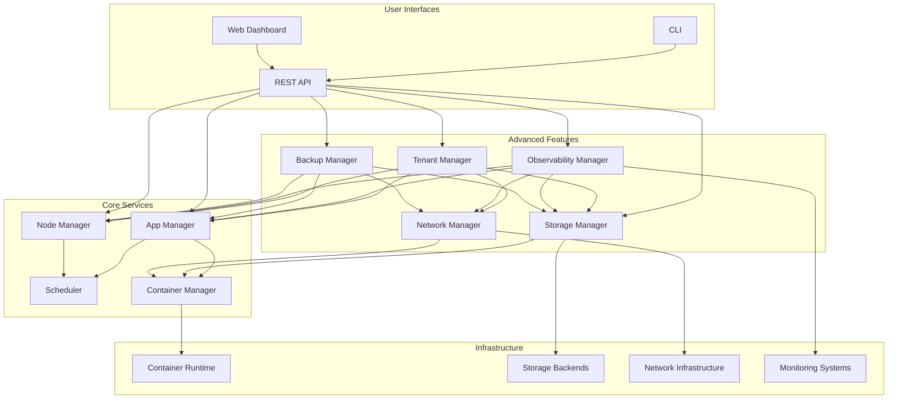
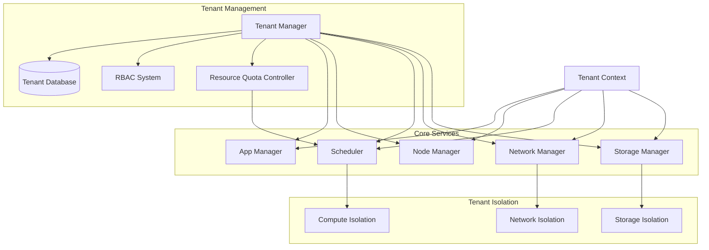
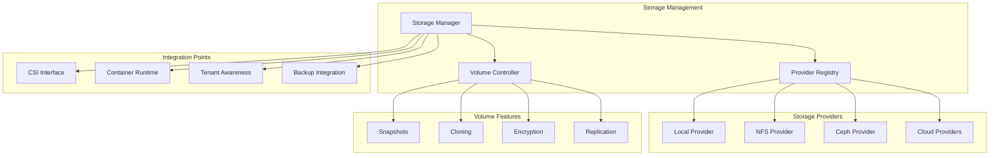
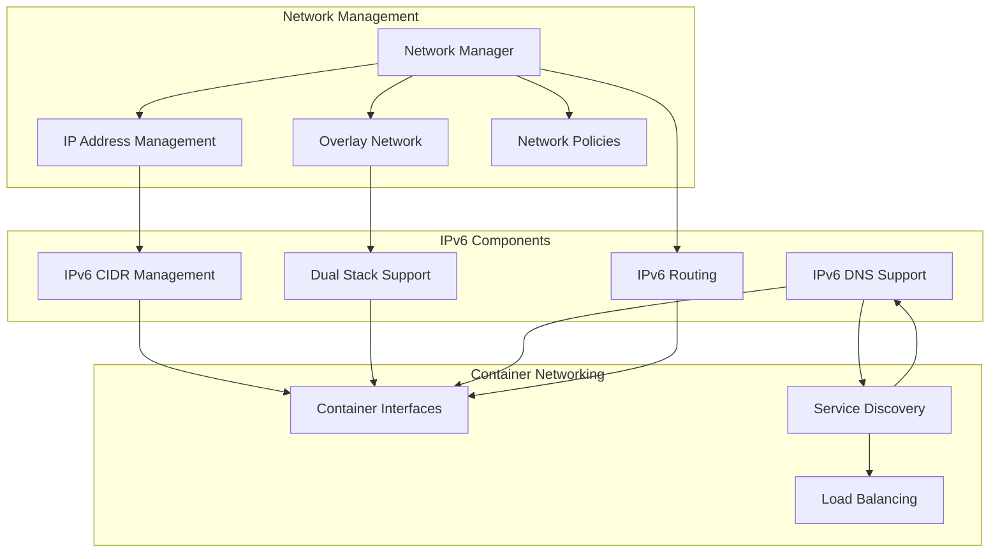
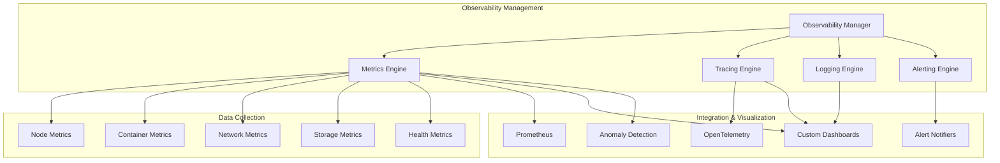
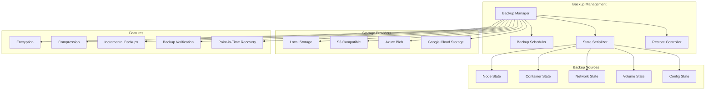
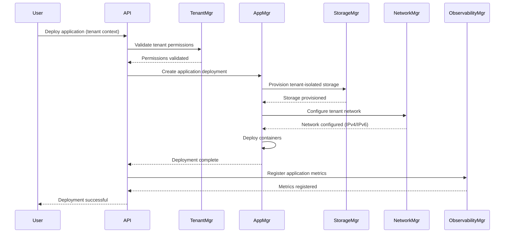

# Hivemind Advanced Features - Technical Architecture

This document provides architectural diagrams showing how the advanced features will be integrated into the existing Hivemind platform.

## System Architecture Overview



## Multi-tenancy Architecture



## Distributed Storage Architecture



## IPv6 Networking Architecture



## Advanced Monitoring Architecture



## Backup/Restore Architecture



## Component Interaction - Sequence Diagram



## Data Flow Diagram

```mermaid
flowchart TD
    User([User]) --> CLI[CLI] & WebUI[Web UI]
    CLI & WebUI --> API[API Server]
    
    subgraph "Control Plane"
        API --> TenantMgr[Tenant Manager]
        API --> AppMgr[App Manager]
        API --> BackupMgr[Backup Manager]
        
        TenantMgr --> AppMgr
        TenantMgr --> StorageMgr[Storage Manager]
        TenantMgr --> NetworkMgr[Network Manager]
        
        AppMgr --> Scheduler[Scheduler]
        Scheduler --> NodeMgr[Node Manager]
        
        BackupMgr --> StateDB[(State Database)]
    end
    
    subgraph "Data Plane"
        NodeMgr --> Node1[Node 1]
        NodeMgr --> Node2[Node 2]
        NodeMgr --> NodeN[Node N]
        
        Node1 & Node2 & NodeN --> ContainerRuntime[Container Runtime]
        StorageMgr --> StorageBackends[(Storage Backends)]
        NetworkMgr --> NetworkInfra[Network Infrastructure]
    end
    
    subgraph "Observability Plane"
        ObservabilityMgr[Observability Manager] --> MetricsDB[(Metrics Database)]
        ObservabilityMgr --> LogsDB[(Logs Database)]
        ObservabilityMgr --> TracesDB[(Traces Database)]
        
        Node1 & Node2 & NodeN --> ObservabilityMgr
        API --> ObservabilityMgr
        TenantMgr & AppMgr & StorageMgr & NetworkMgr & BackupMgr --> ObservabilityMgr
    end