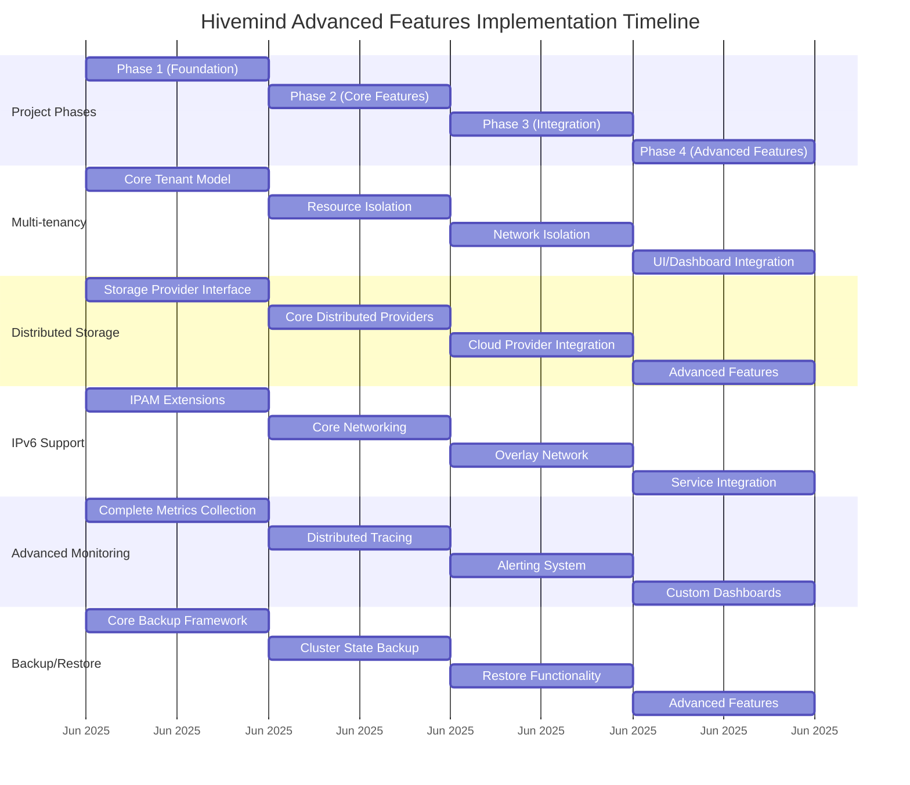
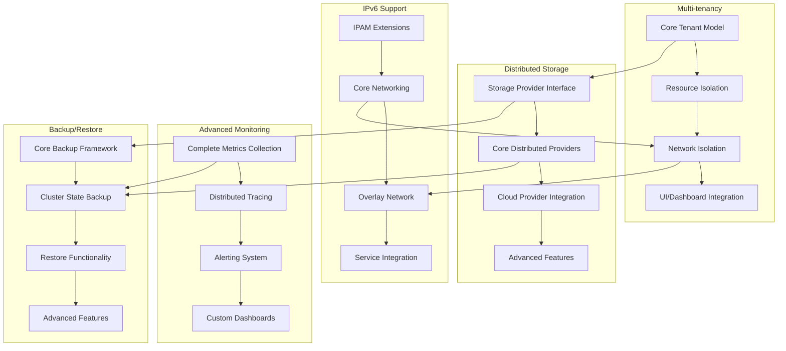
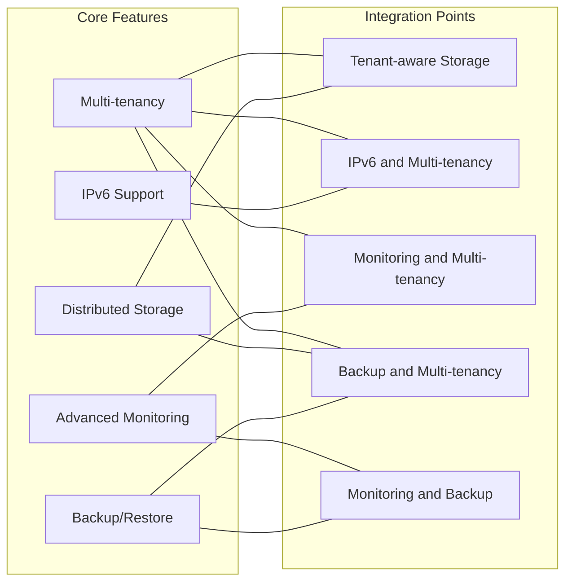

# Hivemind Advanced Features Implementation Timeline

## Implementation Phases Visualization



## Feature Dependencies Diagram



## Integration Points Visualization



## Risk Assessment Matrix

```mermaid
quadrantChart
    title Risk Assessment Matrix
    x-axis Low Impact --> High Impact
    y-axis Low Probability --> High Probability
    quadrant-1 Monitor
    quadrant-2 High Priority
    quadrant-3 Low Priority
    quadrant-4 Contingency Plan
    "Performance Degradation": [0.7, 0.6]
    "Data Consistency Issues": [0.8, 0.5]
    "Backward Compatibility": [0.6, 0.4]
    "Integration Complexity": [0.7, 0.8]
    "Resource Constraints": [0.5, 0.7]
    "Security Vulnerabilities": [0.9, 0.3]
    "External Dependencies": [0.4, 0.6]
    "Scalability Limitations": [0.6, 0.5]